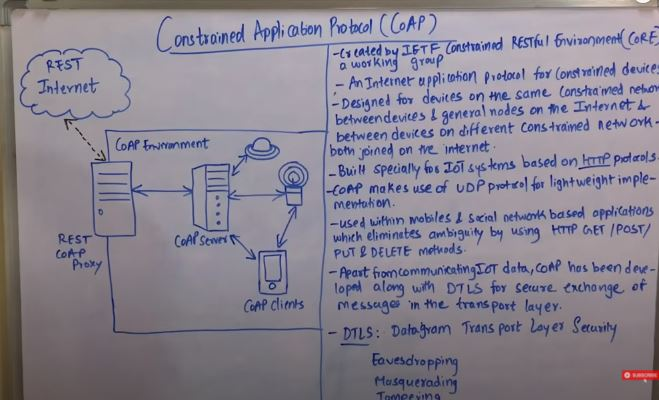

# coap

Constrained Application Protocol (CoAP) is a specialized web transfer protocol for use with constrained nodes and constrained networks in the Internet of Things. 

The protocol was designed by the Internet Engineering Task Force (IETF), CoAP is specified in IETF RFC 7252.

COAP uses UDP as the underlying network protocol. COAP is basically a client-server IoT protocol where the client makes a request and the server sends back a response as it happens in HTTP. The methods used by COAP are the same used by HTTP.

One must take security into account when dealing with IoT protocols. For example, CoAP uses UDP to transport information. CoAP relies on UDP security features to protect information. As HTTP uses TLS over TCP, CoAP uses Datagram TLS over UDP. DTLS supports RSA, AES, and so on.

MQTT uses a publisher-subscriber while CoAP uses a request-response paradigm.
CoAP is essentially a one-to-one protocol very similar to the HTTP protocol. Moreover, MQTT is an event-oriented protocol while CoAP is more suitable for state transfer.

We have to procure Azure L4 LB - UDP  or AWS NLB UDP  for setting up endpoints for CoAP setup.

Rest Coap Proxy <--> Coap Server <--> In-house devices 

--------------------

Links:-

https://dzone.com/articles/coap-protocol-step-by-step-guide

https://www.youtube.com/watch?v=-mG_HjAPji0

https://www.youtube.com/watch?v=U0XlAqFT34s
